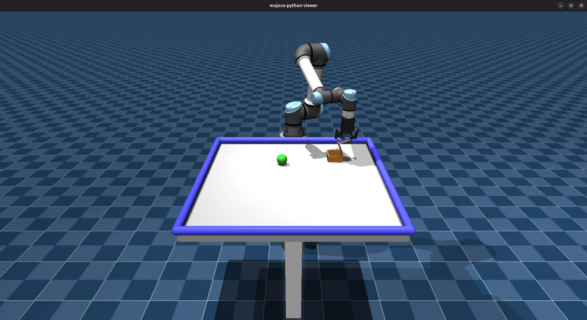

# CMPE591 Final Project - BC + DAgger + SAC on a Lid-Box Manipulation Task

A manipulator has to open the hinged lid of a box, pick up a sphere from the
table, carry it over the box, and drop it inside. The policy is trained in
three stages: behavioral cloning from scripted demonstrations, DAgger to fix
the compounding errors of plain BC, and finally SAC fine-tuning warm-started
from the DAgger policy.

